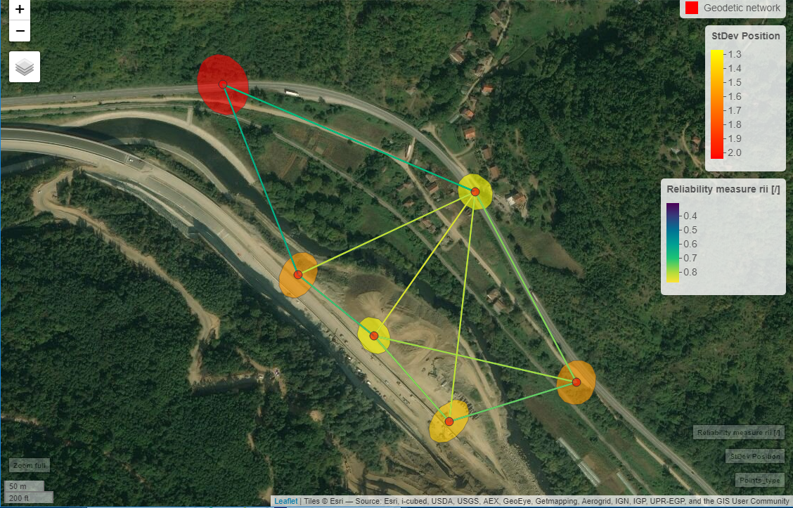

<!-- README.md is generated from README.Rmd. Please edit that file -->

# Surveyor

<!-- badges: start -->

<!-- badges: end -->

Description: Package of Land and Engineering Surveying utilities.  
Authors: Dr Milutin Pejovic, Petar Bursac, Dr Milan Kilibarda,
Aleksandar Sekulic and Dr Branislav Bajat.  
University of Belgrade, Faculty of Civil Engineering, Department of
geodesy and geoinformatics

This work presents the R package surveyor, which provides the
functionalities for common engineering surveying tasks, including
designing and adjusting 1D and 2D geodetic networks, coordinate
transformation and deformation analysis. The package implements
least-square based calculation to evaluate the observations and the
network characteristics. Package surveyor utilizes state-of-the-art
spatial data structures implemented in sf R package to provide a spatial
abstraction of geodetic network. Therefore, it leverages all the related
functionalities from the set of packages and libraries for geospatial
analysis and visualization.

## Installation

To install the development version from
[GitHub](https://github.com/pejovic/Surveyor) you can install the
devtools package with:

``` r
install.packages("devtools")
devtools::install_github("pejovic/Surveyor")
```

## Usage

### Input data

The data must be prepared as given in the figure, the points tab
contains clearly defined columns as well as the observations tab. The
file needs to be in Excel .xlsx format.


Input data are given in the form of two tables, one containing data of
geodetic points, their approximate coordinates, and the selection of
points defining the datum of the network. The second table contains
measurements and/or a selection of measurements that make up the
observation plan, observational equipment precision for the directions
and distances and elevation differences.

### Abstraction of geodetic network - survey.net

First you need to show the path to the input
file:

``` r
file_path <- here::here("Data/Input/With_observations/Grdelica/Grdelica.xlsx")
```

Calling the function creates the basic object survey.net:

``` r
grdelica.snet <- read_surveynet(file = file_path)
```

Result is a list of two sf classes, the first representing the geometry
and descriptive attributes of the points of the geodetic network and the
second with linestrings and associated observational plan. The data are
given in the defined CRS - Reference Coordinate System.

### Network design

Package functionality that enables the design of 1D and 2D geodetic
networks, created by using functions with least-square based
calculation, can be called as
follows:

``` r
grdelica.snet.des <- adjust.snet(adjust = FALSE, survey.net = grdelica.snet, dim_type = "2D", sd.apriori = 3,  all = FALSE)
```

### Network adjustment

Package functionality that enables the adjustment of 1D and 2D geodetic
networks, created by functions based on least-square calculation, can be
called as
follows:

``` r
grdelica.snet.adj <- adjust.snet(adjust = TRUE, survey.net = grdelica.snet, dim_type = "2D", sd.apriori = 3,  maxiter = 50, prob = 0.95, result.units = "cm", all = FALSE)
```

    #> [1] "Model is correct"

Visualization of the results is possible using ggplot2 package:

``` r
plotSurveynet <- function(snet.adj = snet.adj){
  snet.adj$Points$ellipse.net %<>% dplyr::rename(`StDev Position` = sp)
  adj.net_plot <- ggplot() +
    geom_sf(data = snet.adj$Observations)+
    geom_sf(data = snet.adj$Points$ellipse.net, aes(fill = `StDev Position`))+
    geom_sf_text(data = snet.adj$Points$ellipse.net,
                 aes(label=Name,
                     hjust = 2,
                     vjust = 2))+
    xlab("\nEasting [m]") +
    ylab("Northing [m]\n") +
    ggtitle("GEODETIC 2D NETWORK")+
    labs(subtitle = "2D ajdustment results")+
    guides(col = guide_legend())+
    theme_bw()+
    theme(legend.position = 'bottom')
  return(adj.net_plot)
}
```


Visualization of the results is also possible using mapview package:

``` r
mapviewSurveynet <- function(snet.adj = snet.adj, epsg = 3909){
  points <- snet.adj$Points$net.points
  points %<>% dplyr::mutate(Point_type = dplyr::case_when(Point_object == FALSE ~ "Geodetic network",
                                                          Point_object == TRUE ~ "Points at object"))
  observations <- snet.adj$Observations
  ellipses <- snet.adj$Points$ellipse.net
  webmap.net.adj <- mapview(points, zcol = "Point_type", col.regions = c("red","grey"), layer.name = "Points_type") +
    mapview(ellipses, zcol = "sp", col.regions = c("yellow", "red"), layer.name = "StDev Position")+
    mapview(observations, zcol = "rii", layer.name = "Reliability measure rii [/]") 
  return(webmap.net.adj)
}
```

``` r
mapviewSurveynet(snet.adj = grdelica.snet.adj)@map
```



### Deformation analysis

Package functionality that enables the deformation analysis of 1D and 2D
geodetic networks, created by functions based on least-square
calculation, can be called as
follows:

``` r
snet.stable(snet_1_path = "Data/Input/With_observations/Dam/Dam_epoch_0.xlsx", snet_2_path = "Data/Input/With_observations/Dam/Dam_epoch_1.xlsx", sd.apriori = 3, units = "mm",  dim_type = "1D", prob = 0.95, wdh_model = "n_dh")
```

## Contact

Please file bug reports and feature requests send as email at
<mpejovic@grf.bg.ac.rs>.
